## End-to-End MLOps: Credit Default Prediction

**Live Demo:** [https://mlops-credit-fastapi-latest-2.onrender.com/ui](https://mlops-credit-fastapi-latest-2.onrender.com/ui)

### Purpose
To architect and deploy a production-ready Machine Learning solution for financial risk assessment. This project transforms a raw research notebook into a scalable, containerized application hosted on Render, bridging the gap between data science and operational deployment.

### Key Features & Benefits
- **Real-time Decisioning:** API-first design allows immediate credit default risk prediction.
- **Operationalized ML:** Moved beyond static notebooks to a modular codebase serving a REST API and an intuitive Web UI.
- **Reproducibility:** Dockerized environment ensures the model runs consistently across development and production.
- **Experiment Tracking:** Integrated MLflow to log metrics, parameters, and model artifacts for full auditability.

### 🛠️ Tech Stack & Architecture
- **Core:** Python, XGBoost, Scikit-learn.
- **Refactoring:** Converted monolithic Jupyter notebooks into modular scripts (`src/`) for training and inference pipelines.
- **Serving:** FastAPI for the high-performance REST API (exposing `/predict` and health checks).
- **Interface:** Gradio UI mounted at `/ui` for easy manual testing and demonstration.
- **Tracking:** MLflow for experiment management.
- **Containerization:** Docker (running Uvicorn on port 8000).
- **CI/CD:** GitHub Actions builds the Docker image and pushes it to Docker Hub upon code changes.
- **Deployment:** Render (PaaS) automatically pulls the latest image and hosts the service with automatic SSL.

### Deployment Workflow
1.  **Code Push:** Commits to the `main` branch trigger the CI pipeline.
2.  **Build & Push:** GitHub Actions builds the Docker container and pushes it to Docker Registry.
3.  **Deploy:** Render detects the update (or is triggered via webhook), pulls the new image, and rolls out the deployment.
4.  **Access:** Users interact via the FastAPI endpoints or Gradio UI through the secure Render URL.

### Challenges & Solutions
**1. Health Check Failures on Deployment**
*   *Issue:* The service would fail to start because Render couldn't detect a successful response on the default port.
*   *Solution:* Implemented a dedicated root (`GET /`) endpoint in FastAPI for health checks and configured Render to listen specifically on port 8000.

**2. Environment Consistency**
*   *Issue:* Version conflicts between local development (Windows/Mac) and the Linux container.
*   *Solution:* Standardized dependencies using a strict `requirements.txt` and optimized the Dockerfile build process to handle package installation errors gracefully.
*   
### 📸 Project Screenshots

  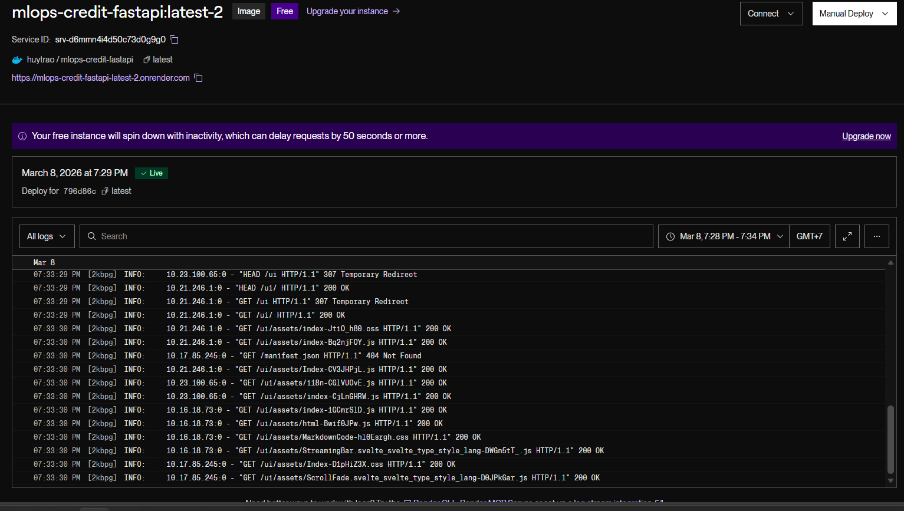 
  <em>Deploy project on Render</em>
  &nbsp;&nbsp;
  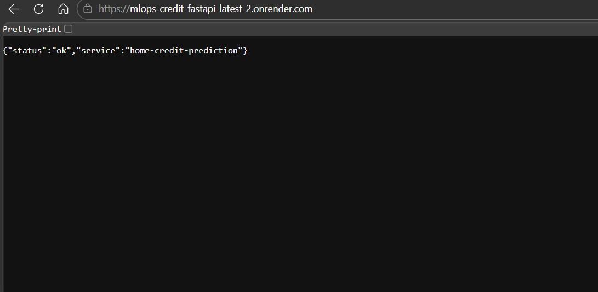 
  <em>Deployment status page</em>
  &nbsp;&nbsp;
   
  <em>Successful deployment</em>

  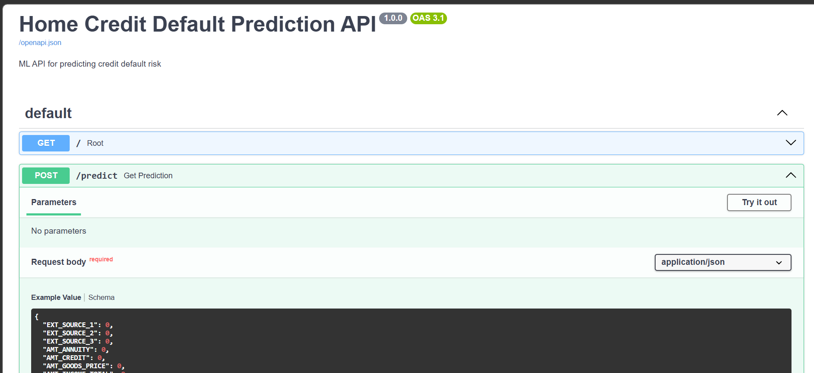 
  <em>FastAPI project structure</em>
  &nbsp;&nbsp;
  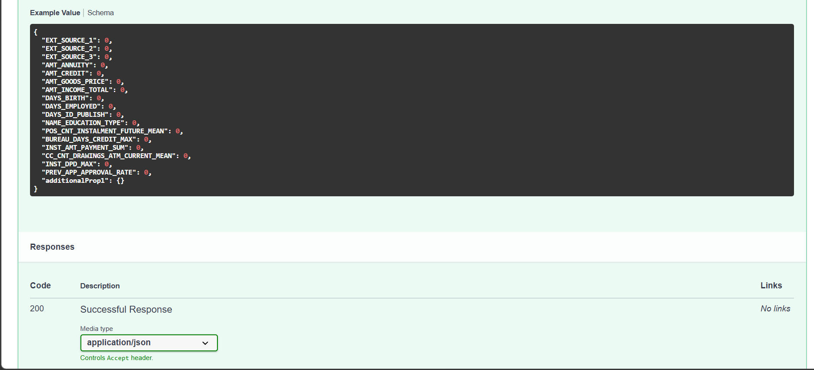 
  <em>API endpoint example</em>
  &nbsp;&nbsp;
  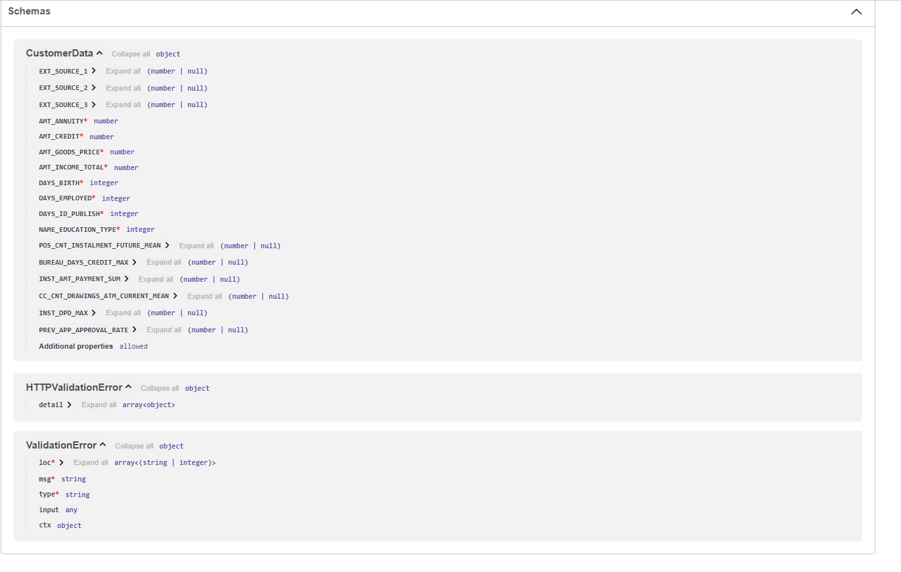 
  <em>FastAPI response sample</em>

  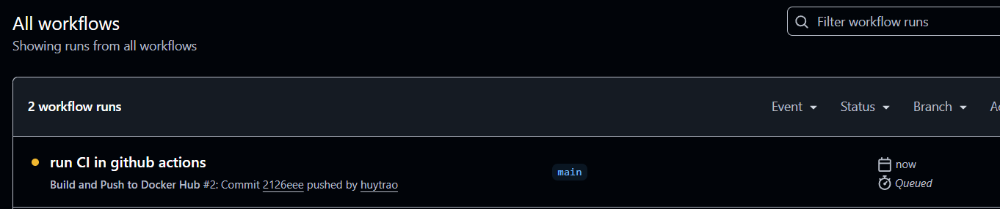 
  <em>GitHub Actions CI workflow</em>
  &nbsp;&nbsp;
  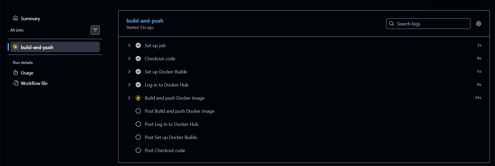 
  <em>CI build process</em>
  &nbsp;&nbsp;
  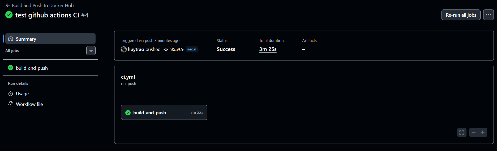 
  <em>Test results in CI</em>

  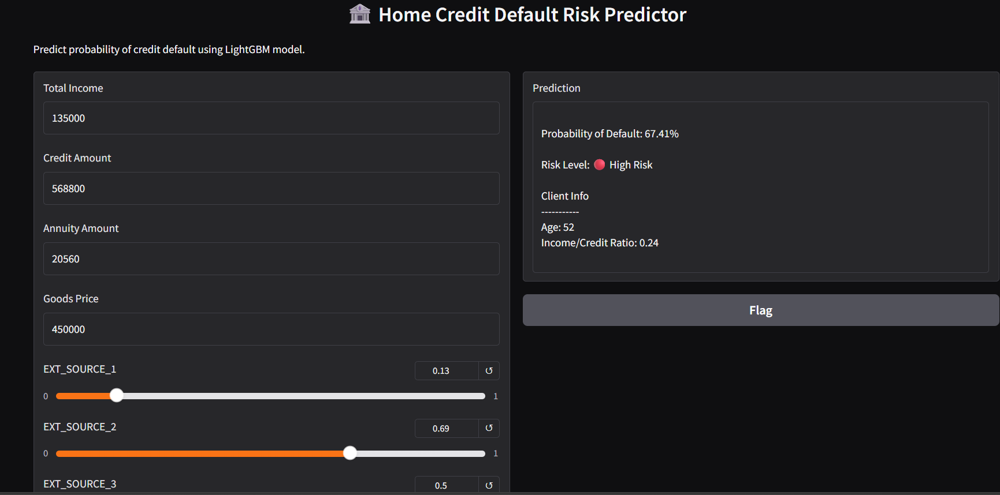 
  <em>Gradio interface</em>
  &nbsp;&nbsp;
  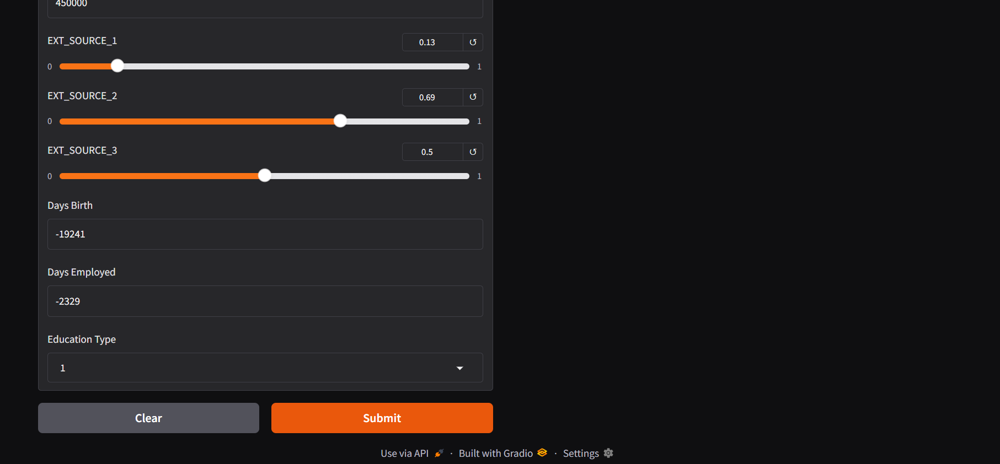 
  <em>User input and output</em>

  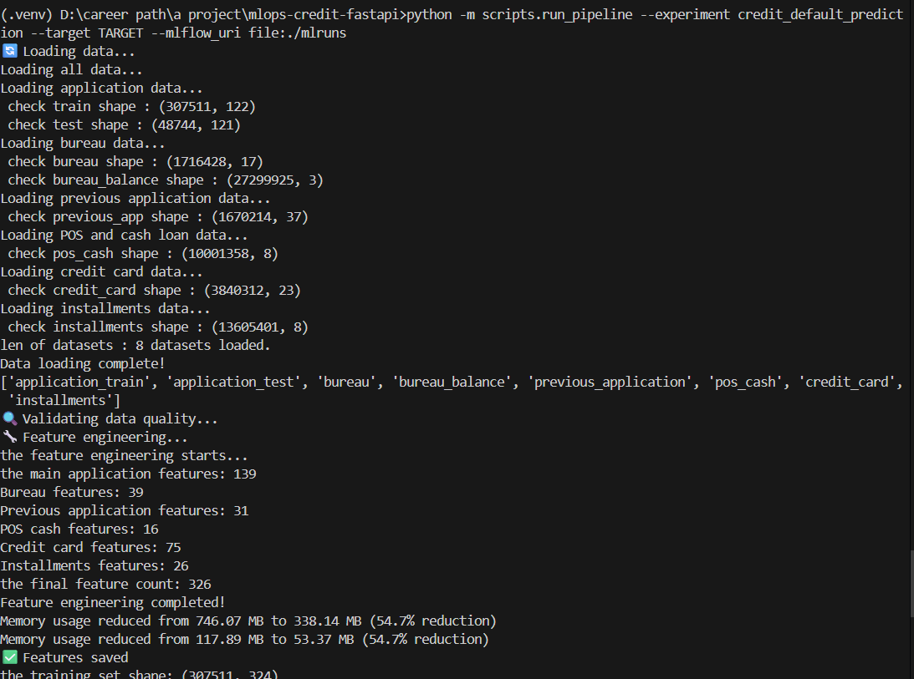 
  <em>Pipeline run result 1</em>
  &nbsp;&nbsp;
  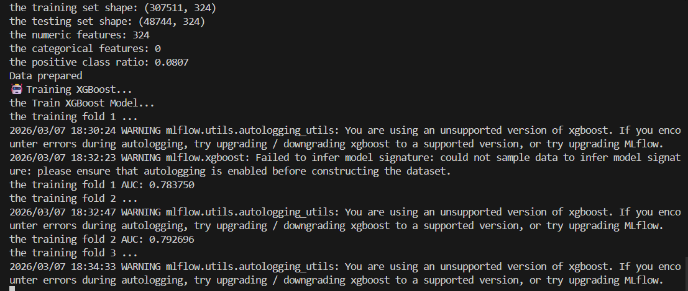 
  <em>Pipeline run result 2</em>

